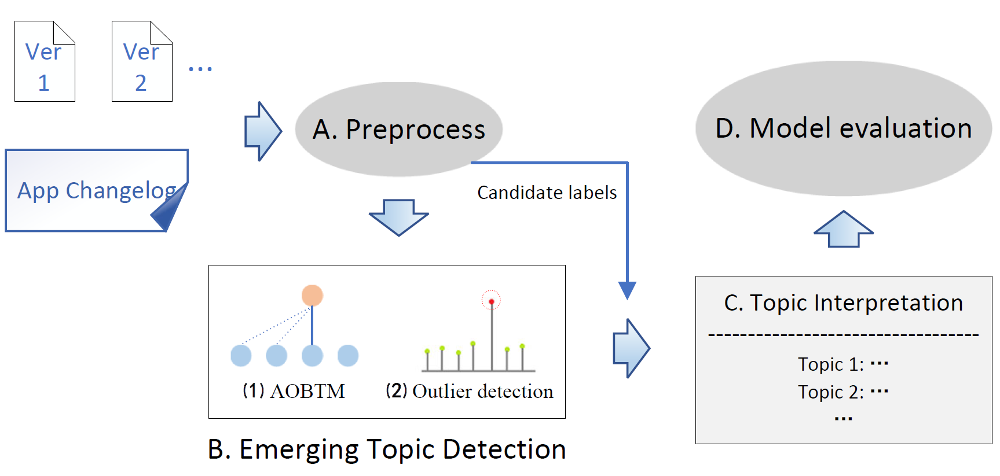

# App Review Emerging Topic Identification Based on Adaptive Online BTM

## 1. Model
This model emplyed to identify emerging topics in reviews from different app versions. The inputs to this model are user reviews for different app versions and changelogs for app versions. The output is the emerging topics identified (interpreted with related phrases and sentences, respectively) and the evaluation score of the model. The overall flow of the model is shown in the figure below.
<p align="center"></p>

## 2. The data set and word2vec model
The dataset used by this project is not public. After online application and IDEA author's consent, obtaining the relevant data set. The application link is as follows: [link](https://goo.gl/forms/nAAkSa5o5yrSIaPr2). Note: the sample data is only used for illustration of the usage of the code. It is not the data set used in the paper. Word2vec model used in this paper download [link](https://www.jianguoyun.com/p/DS-i2AMQgM-xCRjBzu0D ), password: ktiDWY.


## 3.  Input data format
App reviews should be entered in the following format. The attributes are separated by `******`, and only the first five attributes are necessary. 

```
rating******review text******title******date******version******nation
```
## 4. Environment setup
1. The operating system: mac os. If you need to transplant to Linux, you need to override the file line feed command in *1.Processing.py*.
2. Environmental package *gensim* version ==3.8.1
